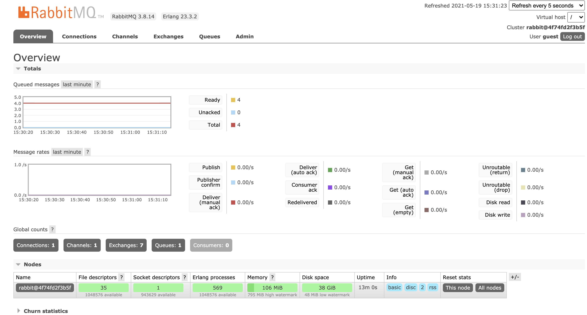

## **JS Project that implements RabbitMQ message broker.** 

### **Prerequisites**
NodeJS, Docker

>>>>>>> Stashed changes
### **Setup**
```
npm install
docker-compose up -d
```

### **Publish a message**
```
node publisher.js 7
```

Note: feel free to replace '7' with other message ID values

### **Consume a message**
```
node consumer.js
```

### **RabbitMQ GUI**
http://localhost:15672

Credentials: use 'guest' as username and password



### **RabbitMQ Docs**
https://www.rabbitmq.com/#features
